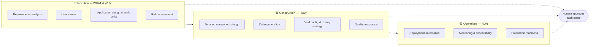

# Session 3 — AI-DLC with Kiro

*Now that you can run Kiro's build loop, layer a repeatable delivery workflow on top of it.*

> **Source & credit:** This session is based on the open-source
> **[awslabs/aidlc-workflows](https://github.com/awslabs/aidlc-workflows)** project by AWS Labs,
> which is the **source of truth** for the AI-DLC rules. This guide distills the **Kiro-specific
> path** and **links back to the original** rather than copying its files — so you always install
> the rules straight from the source. When in doubt, the awslabs repo wins.

---

## 1. What is AI-DLC?

**AI-DLC (the AI-Driven Development Life Cycle)** is an intelligent software development workflow
that adapts to your needs, maintains quality standards, and keeps you in control of the process.

Its defining traits:

- **Adaptive intelligence** — only executes the stages that add value to *your specific* request.
- **Context-aware** — analyzes your existing codebase before acting.
- **Risk-based** — complex changes get comprehensive treatment; simple changes stay efficient.
- **Human-in-the-loop** — *the agent proposes, the human approves.* Critical decisions require
  explicit confirmation.

Think of it as a disciplined conductor for the steering + specs + tasks workflow you already know.

---

## 2. How AI-DLC relates to what you learned

AI-DLC doesn't replace steering and specs — it **orchestrates them**. It installs as a set of
**Kiro steering files** that guide the agent through a consistent lifecycle, generating structured
artifacts along the way. You still review, still approve, still own the outcome.

| Session 2 (freeform) | Session 3 (AI-DLC) |
|----------------------|--------------------|
| You decide when to write requirements/design/tasks | A defined lifecycle prompts you through them |
| Steering files you author | Pre-built `aws-aidlc-rules` steering files |
| Artifacts wherever you put them | Artifacts collected under `aidlc-docs/` |

---

## 3. The three phases

AI-DLC structures delivery into three adaptive phases:



- **🔵 Inception** — determines **WHAT to build and WHY**: requirements analysis, user stories,
  application design and work units, and risk assessment.
- **🟢 Construction** — determines **HOW to build it**: detailed component design, code generation,
  build configuration and testing strategies, and quality assurance.
- **🟡 Operations** — **deployment and monitoring**: deployment automation, monitoring/observability,
  and production readiness.

Because the workflow is adaptive, a small request may skip stages that add no value — and a human
approves before each stage proceeds.

---

## 4. Setup (install the rules from the source)

You install AI-DLC by placing its rule files into your project's `.kiro/` directory. Get the files
straight from the source repository.

### Get the files

Clone the repository (or download the latest release zip from the
[releases page](https://github.com/awslabs/aidlc-workflows/releases/latest)):

```bash
git clone https://github.com/awslabs/aidlc-workflows.git ~/aidlc-workflows
```

> The repo contains rules for several AI tools. For Kiro you only need the `aws-aidlc-rules` and
> `aws-aidlc-rule-details` folders — the commands below copy just those.

### Install into your project

Run these from your **project root**. Adjust the source path if you cloned somewhere else.

**macOS / Linux:**
```bash
mkdir -p .kiro/steering
cp -R ~/aidlc-workflows/aws-aidlc-rules .kiro/steering/
cp -R ~/aidlc-workflows/aws-aidlc-rule-details .kiro/
```

**Windows PowerShell:**
```powershell
New-Item -ItemType Directory -Force -Path ".kiro\steering"
Copy-Item -Recurse "$env:USERPROFILE\aidlc-workflows\aws-aidlc-rules" ".kiro\steering\"
Copy-Item -Recurse "$env:USERPROFILE\aidlc-workflows\aws-aidlc-rule-details" ".kiro\"
```

### Resulting structure

```
<project-root>/
└── .kiro/
    ├── steering/
    │   └── aws-aidlc-rules/          # loaded as steering — drives the workflow
    └── aws-aidlc-rule-details/       # detailed, conditionally-loaded rules
```

---

## 5. Verify the install

- **Kiro IDE:** open the steering files panel and confirm **`core-workflow`** appears under
  *Workspace*.
- **Kiro CLI:** run `kiro`, type `/context show`, and confirm **`.kiro/steering/aws-aidlc-rules`**
  is listed.

If you see it, AI-DLC is active.

---

## 6. Use it

1. **State your intent** in the chat, starting with the exact phrase **`Using AI-DLC, ...`**
   For example:

   > *"Using AI-DLC, build a user authentication system."*

   The workflow activates automatically and guides you from there.
2. **Answer the structured questions** AI-DLC asks to scope the work.
3. **Review the execution plan** to see which stages will run for this request.
4. **Approve each stage** to keep control — the agent proposes, you approve.
5. **Find your artifacts** — everything generated lands in the **`aidlc-docs/`** directory
   (requirements, design specs, implementation plans, testing strategies, and more).

> Run it in **Vibe mode** so the workflow can guide development end to end.

---

## 7. Extending AI-DLC (optional)

AI-DLC includes an extensibility framework: organizations can layer custom rules for **security,
compliance, testing, and resiliency** on top of the core workflow using markdown files organized
under `aws-aidlc-rule-details/extensions/`. This is org-specific and beyond a first workshop —
see the source repo if you need it.

---

## 8. Go deeper

Everything here is a distillation. For the complete, authoritative reference:

- **Repository:** <https://github.com/awslabs/aidlc-workflows>
- **Latest release:** <https://github.com/awslabs/aidlc-workflows/releases/latest>
- **Generated-artifacts reference:** `docs/GENERATED_DOCS_REFERENCE.md` in that repo.

---

## Workshop wrap-up

You've gone from *"what is agentic development?"* to running a structured, human-in-the-loop
delivery lifecycle on your own project. The throughline all day:

**Context (steering) → a plan (specs/AI-DLC) → reviewed execution → your approval.**

That's spec-driven development — the discipline that takes AI work from prototype to product.
